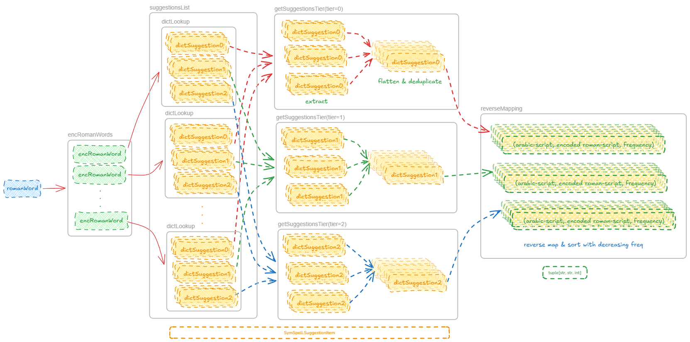

.. *****************************************************************************
   Copyright (c) 2026 RoXimn <roximn148@gmail.com>
   This source code is licensed under the MIT license found in the
   LICENSE.txt file in the root directory of this source tree.
   *****************************************************************************

RomanAlfaz Engine
=================

.. automodule:: romanalfaz.engine
   :members:
   :undoc-members:  # includes objects without docstrings
   :show-inheritance: # shows base classes

.. _romanalfaz-suggest-workflow:

   The internal workflow of the ``RomanAlfaz.suggest``.

   (1) Encode the roman-script input. (2) Get a suggestions list
   from `SymSpell` for each encoding of the roman-script word. (3) Separate
   the *exact*, *one-edit* and *two-edit* suggestions. (4) Flatten the
   three suggestions tiers into a single list each and remove duplicates. (5) Add
   arabic-script word using reverse mapping from the encoded roman word. (6) Sort
   with decreasing word usage frequency. (7) Return the three tiers.
