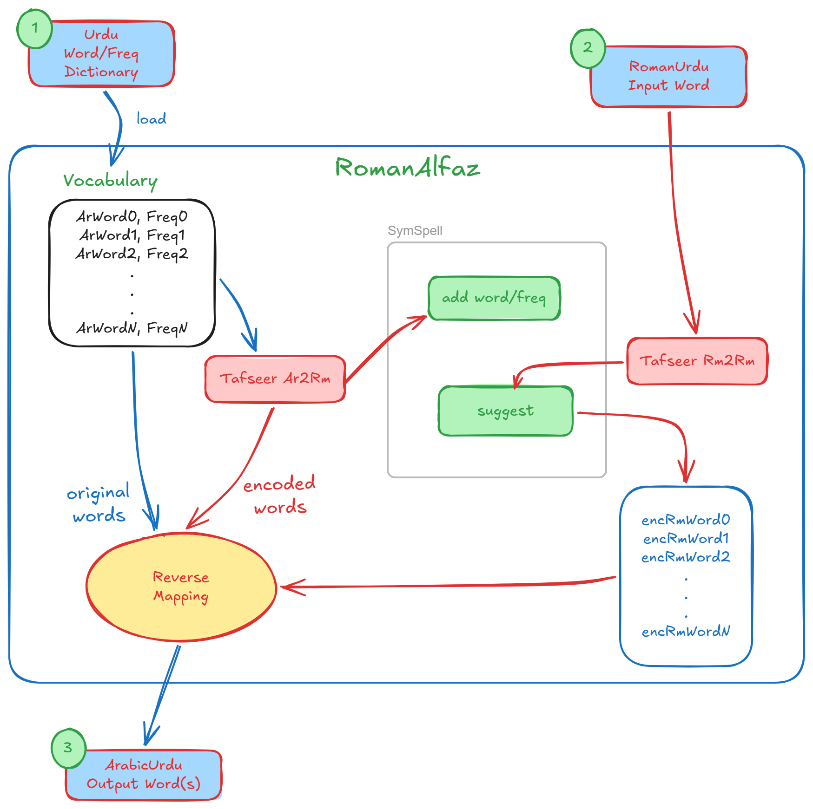

.. *****************************************************************************
   Copyright (c) 2026 RoXimn <roximn148@gmail.com>
   This source code is licensed under the MIT license found in the
   LICENSE.txt file in the root directory of this source tree.
   *****************************************************************************

.. include:: <isonum.txt>

RomanAlfaz (رومن الفاظ) documentation
======================================

RomanAlfaz is a dictionary based predictive roman-to-arabic script
Urdu transliterator which takes a roman transliterated Urdu word and
tries to predict what the expected complete word would be from
a predefined list of matching words in order of usage frequency.

It uses transliteration algorithm proposed by Tafseer Ahmed [#]_
to convert the user provided roman script Urdu text to
an intermediate roman representation which bridges
the textual representation differences between arabic and roman scripts
when writing Urdu. This intermediate representation is then used
to lookup the arabic script representation of the Urdu word.

The RomanAlfaz internally uses SymSpellPy_ for the dictionary lookup from
a predefined curated list of Urdu words and their usage frequencies.
The initial word list is taken from CLE Urdu 5000 most frequently used words [#]_.
The workflow is shown in the :ref:`figure<romanalfaz-workflow>` below.

.. _romanalfaz-workflow:

   The internal workflow of the RomanAlfaz.

   **(1)** Load a dictionary,
   **(2)** ask for suggestion(s) with a word in roman script, and
   **(3)** get the suggestions(s) in arabic script.

   **Blue** arrows represent *Arabic* script and **Red** arrows represent *Roman* script.

..  [#] Roman to Urdu Transliteration using word list. (2009)
    https://cle.org.pk/clt09/download/ahmed_translit.pdf
..  [#] Urdu 5000 most Frequently Used Words
    https://www.cle.org.pk/software/ling_resources/UrduHighFreqWords.htm
..  _SymSpellPy: https://github.com/mammothb/symspellpy

.. toctree::
   :maxdepth: 1
   :caption: Contents:

   algorithm
   engine
   utils

Indices and tables
==================

* :ref:`genindex`
* :ref:`modindex`
* :ref:`search`